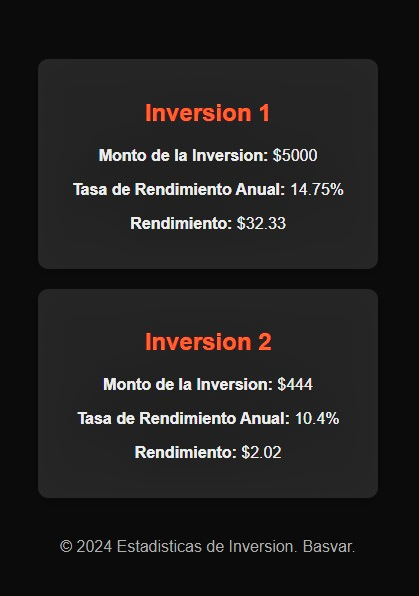
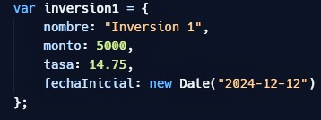

# Inversiones

Una herramienta simple donde puedes mostrar a tu publico en tu sitio web sobre tus inversiones, asi mismo en tiempo real procesa la ganancia de la inversion y se actualiza cada 24 horas de forma automatica.

¿Cómo funciona?
======
El publico lo visualizara de la siguiente forma:

En la siguiente linea de codigo puedes editarla infinidad de veces, tambien si necesitas contar mas inversiones podras solamente copiar la misma linea y pegar el codigo las veces que necesites añadir mas:

Creador
======
Basvar, inc

basvar.com

contacto@basvar.com